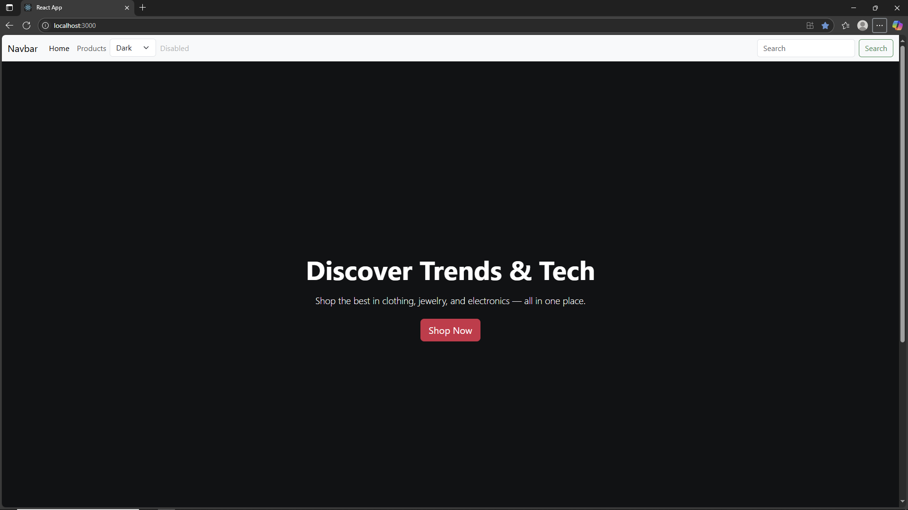
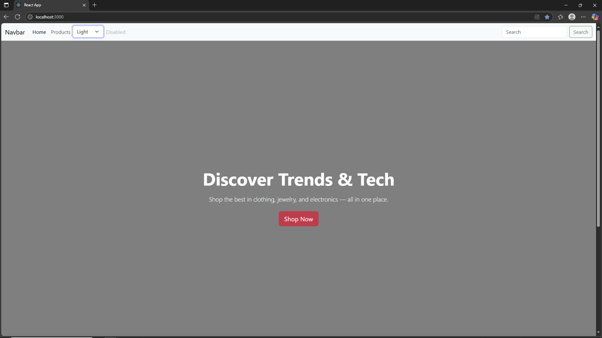

## 📸 Preview

.png)

.png)

This spinner appears while the `Products` page fetches data from the Fake Store API.
It uses Bootstrap’s `spinner-border` or `spinner-grow` variant, with support for light/dark themes.

The spinner **automatically changes color** based on the selected light or dark theme of the website.

**Home Page — Dark Theme**

The same **conditional rendering** logic is used on the **Home** page as well.

.png)

The product page render cards using bootstrap grid layout.